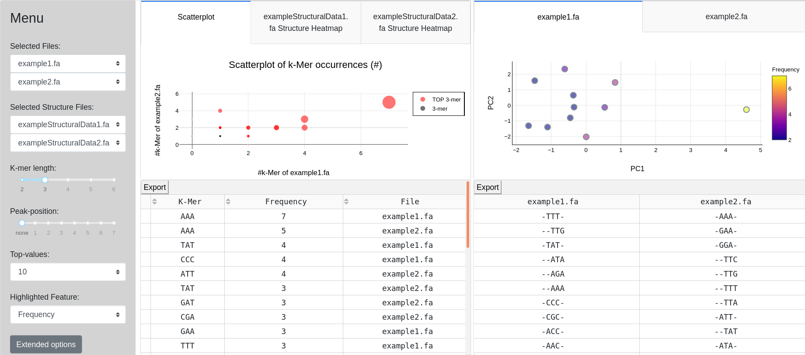

# k-mer-Dash 

## Intro

This tool harnesses the interactive Python framework Dash to allow users analyzing their sequence-based data.
Interactive plots and widgets are utilized to filter the data and discover sequence patterns.
A web-based Dash application will be initialized to share the data with collegues over the web browser.


## Getting Started
To use the app follow these instructions:

### Cloning / Downloading the source code
Cloning the source code to your local directory:

```
git clone https://github.com/lehecht/k-mer-Dash.git
```

Or downloading the source code from:
[https://github.com/lehecht/k-mer-Dash](https://github.com/lehecht/k-mer-Dash)

### Requirements
**k-mer Dash** runs with python 3.6. It is recommended to use a virtual environment.

#### Dependencies
The app makes use of external python-libraries, which need to be installed.
Setting up libraries, use:

```
pip3 install -r requirements.txt
```

Additionally **ClustalW** needs to be installed.

A system wide installation can be accomplished by (debian and ubuntu):
```
sudo apt install clustalw
```
Or by downloading from: [http://www.clustal.org/clustal2/](http://www.clustal.org/clustal2/) 
 
## Input
| parameter | Description |
|-------|---------------------------------------------|
| -f1 FILE1 -f2 FILE2 | FASTA formatted file(s) with sequences of equal length|
| -k INT | Length of generated k-mer subsequences |
| -p INT | Highlighted position in sequence, e.g. center of a binding site |
| -t INT | Number of displayed top k-mer frequencies* |
| -c STR | Boolean starting program with GUI or on command-line |
| -pt INT | Custom port (only for GUI) |

\* The top value and number of results may differ if there are multiple k-mers with equal frequencies

## Output
On valud input parameters a Dash application is started to explore various k-mer visualizations and statistics.
It visualizes data as diagrams (Scatterplot, PCA) and tables (k-mer Frequency-table, Alignment-table).

## Description

### Command-line
In order to use the application via command-line only requires to set 'console' parameter `-c` on `True`.
Mandatory parameters are `-f1`,`-f2` and `-k`. All other parameters are optional.

#### Example:

The git project contains failsafe examples of generated fasta file in the *example* folder. An invokation to display the data on the console is listed below:

```
python3 main.py -f1 example/example1.fa -f2 example/example2.fa -k 4 -t 5 -c True
```

#### Console Output:

```
Alignment of Top-kmere created with ClustalW
(for more information, see: http://www.clustal.org/clustal2/)

File: example1.fa
-TATA-
ATAT--
--AAAA
ACCC--
-CCCC-
AACC--

File: example2.fa
--ATAT--
---TATA-
--TTAT--
---TATT-
--TAAT--
---AATT-
-ATTA---
--TTAA--
--TTTC--
--TTCC--
-ATTC---
--TTTG--
--ATTG--
GATT----
-GTGA---
--TGAT--
--CGAT--
--TCGA--
--GCGC--
---CGCG-
----GCGA
--ACGT--
---CGTG-
--TTGG--
---TGGA-
----GGAC
----GAAC
----GGAA
--CCGG--
---CGGA-
---CGAA-
-GCCC---
--CCCC--
--CCCA--
--CCAC--
--TCCA--
--CCAA--
----AAAA
-GCTA---
--CTAG--
---TAGC-
----AGCA


Options:
k: 4, peak: None, top: 5, files: ['example/example1.fa', 'example/example2.fa']

k-Mer		Frequency	File
AAAA		4		example1.fa
AACC		2		example1.fa
ACCC		2		example1.fa
CCCC		2		example1.fa
TATA		2		example1.fa
ATAT		2		example1.fa
AAAA		4		example2.fa
CGAT		2		example2.fa
GATT		2		example2.fa
ATAT		2		example2.fa
TTTC		1		example2.fa
TTCC		1		example2.fa
TCCA		1		example2.fa
CCAA		1		example2.fa
GCGC		1		example2.fa
CGCG		1		example2.fa
GCGA		1		example2.fa
CGAA		1		example2.fa
TTTG		1		example2.fa
TTGG		1		example2.fa
TGGA		1		example2.fa
GGAC		1		example2.fa
ACGT		1		example2.fa
CGTG		1		example2.fa
GTGA		1		example2.fa
TGAT		1		example2.fa
GCTA		1		example2.fa
CTAG		1		example2.fa
TAGC		1		example2.fa
AGCA		1		example2.fa
CCGG		1		example2.fa
CGGA		1		example2.fa
GGAA		1		example2.fa
GAAC		1		example2.fa
ATTA		1		example2.fa
TTAT		1		example2.fa
TTAA		1		example2.fa
TAAT		1		example2.fa
AATT		1		example2.fa
ATTG		1		example2.fa
TATA		1		example2.fa
TATT		1		example2.fa
GCCC		1		example2.fa
CCCC		1		example2.fa
CCCA		1		example2.fa
CCAC		1		example2.fa
TCGA		1		example2.fa
ATTC		1		example2.fa
```


##### Plots

\
\

\
\


### Graphical-User-Interface Output:
Starting the application with the interactive user interface requires no parameter except for FASTA-Files (-f1 and -f2).
Port number is optional.

#### Example:
```
python3 main.py -f1 example/example1.fa -f2 example/example2.fa
```

#### Output:


#### Settings

**Menu:**

* '_Select-Files_'-Dropdown (coming soon): Select two files of given list of files, for which analysis should be done

* Slider: Set values for their property

* '_Highlighted-Feature_'-Dropdown: Change coloring in PCA plots from k-mer-frequency ('Frequency') to thymine-frequency in k-mer ('#T')

#### Features

Tables:

* _Export_-Button: Export tables to csv-file

* Frequency-Table-Sorting: Sort by k-mers, frequency or filename

PCA:

* Tabs: Change view between PCAs

Plots:

* Dash-Features: Image-download, Zooming, Scaling, etc...

## License
MIT

## Refrences
**ClustalW**: Julie D. Thompson, Desmond G. Higgins, Toby J. Gibson, CLUSTAL W: improving the sensitivity of progressive multiple sequence alignment through sequence weighting, position-specific gap penalties and weight matrix choice, Nucleic Acids Research, Volume 22, Issue 22, 11 November 1994, Pages 4673–4680, https://doi.org/10.1093/nar/22.22.4673

